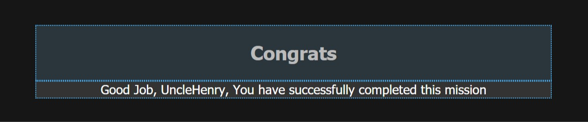
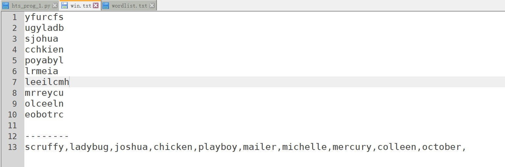

Programming missions

Level 1

截图：





```
#coding=utf-8
# author: UncleHenry

#Hackthissite Programming missions
#	-Level 1	
#	-Unscramble the words

# This level is about unscrambling words.
# Find the original (unscrambled) words, which were randomly taken from a wordlist.<--
# Send a comma separated list of the original words, in the same order as in the list below.
# You have 30 seconds time to send the solution.

#题意解读：
#整理字符串，找到从wordlist里随机取出来【随机=字符顺序被打乱了】的字符串
#30s内，以逗号为间隔，输入下面这些字符串原来(wordlist里的)形式

#用法：
#	- 下载包
#	- 改路径-->L41	L43
#	- 复制题目中字符串到win.txt，覆盖、保存
#	- 运行，在txt中取结果

def sorts(xstr):
	'''
	按一定顺序排列字符串
	'''
	foo = list(xstr)
	foo.sort()
	return("".join(foo))

def replace_enter(xstr):
	'''
	去掉换行\n
	'''
	return(xstr.split('\n')[0])

if __name__ == "__main__":				
	#out = {}	#字典，排序用，其实我会错了题意，本题用不上...
	out = []
	out2 = []
	fin = open(r"F:\桌面\win.txt","r+")
	foo = fin.readlines()
	f = open(r"F:\桌面\wordlist.txt","r")
	fBB = f.readlines()

	for a in foo:
		for i,A in enumerate(fBB):
				if sorts(a) == sorts(A):# 按同一种规则排序...
					out.append(A)	#如果一样，原来wordlist里的正常单词就会被存好

	fin.write('\n'+"-"*8+'\n')
	for i in out:
		fin.write(replace_enter(i)+',')	#注意，最后一个逗号要自己删除
	print(out)

	fin.close()
	f.close()


```
