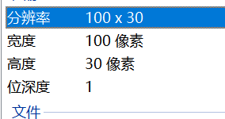

# Hackthissite Programming missions
## author: UncleHenry
Level 2	
Analyze the picture and find the ascii code
- 图片尺寸

- 题目图片（题中的图每次都是随机的）

```
#coding=utf-8
# This level is about image analyzing.
# The pixels in the above image are numbered 0..99 for the first row, 100..199 for the second row etc. 
#White pixels represent ascii codes. 
#The ascii code for a particular white pixel is equal to the offset from the last white pixel. 
#For example, the first white pixel at location 65 would represent ascii code 65 ('A'), the next at location 131 would represent ascii code (131 - 65) = 66 ('B') and so on.
# The text contained in the image is the answer encoded in Morse, where "a test" would be encoded as ".- / - . ... -"
# You have 15 seconds time to send the solution.
 
#题意解读：
#步骤：	图片-->Morse莫斯码-->答案
#图片解码题。图片尺寸是100列*30行的，第1行是0-99，第2行是100-199

#得到Morse码：用偏移值求，例如当前位置是65列，上一个位置是0列，那么ascii值就是65（对应字符'A'）；以此类推
# 算法核心
#ascii_value = chr((current_P-last_P)
#last_P = current_P

#使用时动作要快，下载图片，运行程序，复制结果，一气呵成

#from PilLite import Image
from PIL import Image
# PIL--> Image--> load--> pix[x,y]
morse = {
    '.-' : 'A', '-中...' : 'B', '-.-.' : 'C', '-..' : 'D', '.' : 'E',
    '..-.' : 'F', '--.' : 'G', '....' : 'H', '..' : 'I', '.---' : 'J',
    '-.-' : 'K', '.-..' : 'L', '--' : 'M', '-.' : 'N', '---' : 'O',
    '.--.' : 'P', '--.-' : 'Q', '.-.' : 'R', '...' : 'S', '-' : 'T',
    '..-' : 'U', '...-' : 'V', '.--' : 'W', '-..-' : 'X', '-.--' : 'Y',
    '--..' : 'Z', '-----' : '0', '.----' : '1', '..---' : '2', '...--' : '3',
    '....-' : '4', '.....' : '5', '-....' : '6', '--...' : '7', '---..' : '8',
    '----.' : '9',' ':' ' ,'':''}


img = Image.open('F:\桌面\img.png')
f = open(r"F:\桌面\1.txt","a+")
print(img.size)
pix = img.load()
w, h = img.size	#	100*30

last_P = 0
current_P = 0
cha = []
ch = []
c = []

for y in range(h):#0-30
	for x in range(w):	#100
		if pix[x,y] == 1:
			current_P = 100*y+x	#关键
			cha.append(chr((current_P-last_P)%256))
			last_P = current_P 
			
#print(cha)

#拆分各个morse码
cha = ''.join(cha).split(' ')	

for i in cha:
	c.append(morse[i])
	
	
print('-'*8)
print(''.join(c))
f.write('\n'+''.join(c))	#写到txt文件中去
f.close()

```


